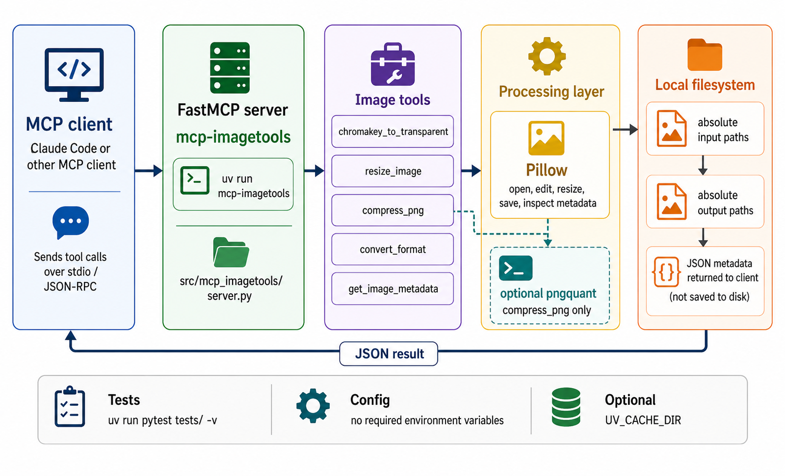

<div align="center">
  

  # mcp-imagetools

  **🖼️ Image processing tools for Claude Code — chromakey, resize, compress, and convert images via MCP 🔧**
</div>

mcp-imagetools is a Python MCP server that exposes local image-processing tools to Claude Code and other MCP clients. It handles chromakey transparency, resizing, PNG compression, format conversion, and metadata inspection through file-based tool calls.

Every tool works with absolute filesystem paths and returns JSON metadata, so it is practical for agent workflows that need to transform images and continue using the generated files.

## Install

```bash
git clone https://github.com/tsilva/mcp-imagetools.git
cd mcp-imagetools
uv sync
```

Add the server to Claude Code:

```bash
claude mcp add image-tools --scope user -- \
  uv run --directory /path/to/mcp-imagetools mcp-imagetools
```

Run it directly from the repository with:

```bash
uv run mcp-imagetools
```

## Tools

| Tool | Description |
| --- | --- |
| `chromakey_to_transparent` | Converts a keyed color, default `#00FF00`, to PNG transparency with graduated alpha edges. |
| `resize_image` | Resizes by width, height, or scale factor, with optional aspect-ratio preservation. |
| `compress_png` | Optimizes PNG files through `pngquant` when that CLI is installed. |
| `convert_format` | Converts between PNG, JPEG, WebP, GIF, and BMP based on the output extension. |
| `get_image_metadata` | Returns format, dimensions, file size, and transparency information. |

Example MCP tool arguments:

```python
resize_image(
    input_path="/Users/me/images/source.png",
    output_path="/Users/me/images/thumb.png",
    width=200,
)

convert_format(
    input_path="/Users/me/images/thumb.png",
    output_path="/Users/me/images/thumb.jpg",
)
```

## Commands

```bash
uv sync                       # install runtime dependencies
uv sync --all-extras          # install runtime and dev dependencies
uv run pytest tests/ -v       # run tests
uv run mcp-imagetools         # start the MCP server
```

## Notes

- Python 3.10 or newer is required.
- All `input_path`, `output_path`, and `image_path` values must be absolute paths.
- `pngquant` is optional. Without it, `compress_png` returns the original PNG and includes a note in the JSON response.
- No environment variables are required for basic operation. `.env.example` only documents the optional `UV_CACHE_DIR`.
- Chromakey uses Euclidean RGB distance: below `tolerance` becomes fully transparent, below `tolerance * 3` gets graduated alpha, and the rest remains opaque.
- JPEG and BMP outputs cannot preserve transparency; transparent pixels are composited onto white when needed.

## Architecture



## License

[MIT](LICENSE)
